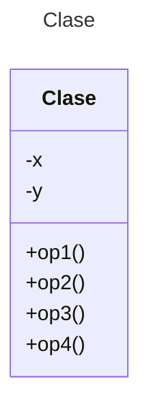

# Proyecto (Maven) - StockMarket

**Asignación del Patrón de Diseño Observer**

Esta asignación te dará práctica en el uso del Patrón de Diseño Observer.

Considera un sistema de comercio de acciones en el que hay un mercado de valores que realiza un seguimiento de todas las operaciones de acciones específicas (sujetos) y debe informar a todos los traders (observadores) cuando se ha realizado una nueva operación para una determinada acción. Las acciones se distinguen por acrónimos cortos (por ejemplo, MSFT, GOOG, AAPL). Una operación de una acción específica puede ser una compra o venta y ocurre a un precio determinado. Cada sujeto acción mantendrá una lista de todos los traders registrados con ella y notificará a cada trader registrado cuando se haya realizado una operación para esa acción específica.

Diseña la clase Trader (que implementa la interfaz Observer)
Diseña la clase Stock (que implementa la interfaz Subject)

Escribe código de prueba que cree un StockMarket así como 3-4 objetos Stock. Crea 3-4 objetos Trader. Haz que el mercado de valores registre cada trader con algunas acciones y luego haz que los traders realicen operaciones para esas acciones. Recuerda que las operaciones son compra o venta y ocurren a un precio determinado. Asegúrate de que tu código de prueba ilustre cómo cada trader es notificado cuando se realiza una operación para las acciones con las que están registrados. Un Trader puede poseer muchas acciones. Una acción puede ser propiedad de muchos Traders. Esto es muy importante para el diseño del proyecto.

Cada acción tendrá su propia lista de observadores. Probablemente tendrás que agregar los observadores a cada acción por separado de su constructor. 

La salida debe tener no solo el nombre del trader y la cantidad, sino que también debe indicar el símbolo de la acción y el tipo de transacción (compra o venta).

Aquí hay un ejemplo de salida:

* *The latest trade is Trader: Julie sell $160.0 Stock: MSFT*

* *The latest trade is Trader: Julie sell $160.0 Stock: MSFT*

* *The latest trade is Trader: Amy sell $165.0 Stock: AAPL*

* *The latest trade is Trader: Amy sell $165.0 Stock: AAPL*

* *The latest trade is Trader: Julie buy $170.0 Stock: GOOG*

## Diagrama de clases
[Editor en línea](https://mermaid.live/)

[Referencia-Mermaid](https://mermaid.js.org/syntax/classDiagram.html)

## Prompt para generar el Diagrama de Clases con IA - mermAID
```
@mermaid /uml
```
## Diagrama de clases UML con draw.io

El repositorio está configurado para crear Diagramas de clases UML con ```draw.io```. Para usarlo simplemente das doble clic en el archivo  ```uml.class.drawio.png``` y se activará el editor ```draw.io``` incrustado en ```VSCode``` para edición. Asegúrate de agregar las formas UML en el menú de formas del lado izquierdo (opción ```+Más formas```). Al final insertas el archivo ```uml.class.drawio.png``` en apartado de UML de este archivo README.

Para más información consulta el [MarketPlace](https://marketplace.visualstudio.com/items?itemName=hediet.vscode-drawio).

## Versión de Java

Verifica que tengas la versión adecuada de Java para trabajar con Maven. En caso de requerir una versión especial, usa los siguientes comandos.

### Verificar versión actual
```
java --version
```
### Verificar versiones disponibles para instalar
```
sdk list java
```
### Instalar la última versión
```
sdk install java
```
### Instalar una versión específica
```
sdk install java xxx-version
```
Ejemplo:
```
sdk install java 17.0.18-ms
```
## Uso del proyecto con Maven

### Compilar
```
mvn compile
```
### Probar N tests
```
mvn test
```
### Probar 1 test
```
mvn test -Dtest="AppTest#testTrading1"
mvn test -Dtest="AppTest#testTrading2"
mvn test -Dtest="AppTest#testTrading3"
mvn test -Dtest="AppTest#testTrading4" 
```
### Ejecutar App
```
java -cp app/target/classes miPrincipal.App
```
### Ejecutar App con Maven
```
mvn exec:java
```
### Empacar App
```
mvn package
```
### Limpiar binarios
```
mvn clean
```
## Comandos Git-Cambios y envío a Autograding

### Por cada cambio importante que haga, actualice su historia usando los comandos:
```
git add .
git commit -m "Descripción del cambio"
```
### Envíe sus actualizaciones a GitHub para Autograding con el comando:
```
git push origin main
```
