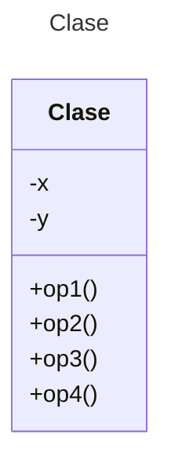

# Proyecto (Maven) - StockMarket

**Observer Design Pattern Assignment**

This assignment will give you practice in using the Observer Design Pattern.

Consider a stock trading system whereby there is a stock market that keeps track of all trades of specific stocks (subjects) and must inform all traders (observers) when a new trade has been made for a certain stock. Stocks are distinguished by short acronyms (i.e. MSFT, GOOG, AAPL. A trade of a specific stock can be either a buy or sell and it occurs at a certain price. Each stock subject will maintain a list of all traders registered with it and will notify each registered trader when a trade has been made for that specific stock.

Design the Trader class (which implements the Observer interface)
Design the Stock class (which implements the Subject interface)

Write some test code that creates a StockMarket as well as 3-4 Stock objects. Create 3-4 Trader objects. Have the stock market register each trader with a few stocks and then have the traders make trades for those stocks. Remember trades are either a buy or sell and occur at a certain price. Make sure your test code illustrates how each trader is notified when a trade for the stock(s) they are registered for is made. A Trader can own many stocks. A stock can be owned by many Traders. This is very important to the design of the project.

Each stock will have its own list of observers. You will probably have to add the observers to each stock separately from their constructor. 

The output must have not only the trader’s name and amount, it must indicate the stock symbol and the transaction type (buy or sell).

Here’s some sample output:

* *The latest trade is Trader: Julie sell $160.0 Stock: MSFT*

* *The latest trade is Trader: Julie sell $160.0 Stock: MSFT*

* *The latest trade is Trader: Amy sell $165.0 Stock: AAPL*

* *The latest trade is Trader: Amy sell $165.0 Stock: AAPL*

* *The latest trade is Trader: Julie buy $170.0 Stock: GOOG*

## Diagrama de clases
[Editor en línea](https://mermaid.live/)

[Referencia-Mermaid](https://mermaid.js.org/syntax/classDiagram.html)

## Prompt para generar el Diagrama de Clases con IA - mermAID
```
@mermaid /uml
```
## Diagrama de clases UML con draw.io

El repositorio está configurado para crear Diagramas de clases UML con ```draw.io```. Para usarlo simplemente das doble clic en el archivo  ```uml.class.drawio.png``` y se activará el editor ```draw.io``` incrustado en ```VSCode``` para edición. Asegúrate de agregar las formas UML en el menú de formas del lado izquierdo (opción ```+Más formas```). Al final insertas el archivo ```uml.class.drawio.png``` en apartado de UML de este archivo README.

Para más información consulta el [MarketPlace](https://marketplace.visualstudio.com/items?itemName=hediet.vscode-drawio).

## Uso del proyecto con Maven

### Compilar
```
mvn compile
```
### Probar N tests
```
mvn test
```
### Probar 1 test
```
mvn test -Dtest="AppTest#testTrading1"
mvn test -Dtest="AppTest#testTrading2"
mvn test -Dtest="AppTest#testTrading3"
mvn test -Dtest="AppTest#testTrading4" 
```
### Ejecutar App
```
java -cp app/target/classes miPrincipal.App
```
### Ejecutar App con Maven
```
mvn exec:java
```
### Empacar App
```
mvn package
```
### Limpiar binarios
```
mvn clean
```
## Comandos Git-Cambios y envío a Autograding

### Por cada cambio importante que haga, actualice su historia usando los comandos:
```
git add .
git commit -m "Descripción del cambio"
```
### Envíe sus actualizaciones a GitHub para Autograding con el comando:
```
git push origin main
```
